# Companion Application — ShoulderSense v5

**ShoulderSense** is a PyQt5 desktop application for frozen shoulder rehabilitation. It connects to the three IMU sensor nodes over BLE, computes shoulder and elbow joint angles in real time, guides the patient through an exercise session, and stores the results for long-term progress tracking.

```bash
cd Graph_3D_v7
pip install -r requirements.txt
python main.py
```

**Dependencies:** `PyQt5 >=5.15`, `pyqtgraph >=0.13`, `scipy >=1.10`, `numpy >=1.24`, `bleak >=0.21`

---

## System Data Flow

The application has two concurrent threads that communicate only through a shared, lock-protected `AppState` object — the BLE thread never touches the GUI, and the GUI thread never touches BLE directly.

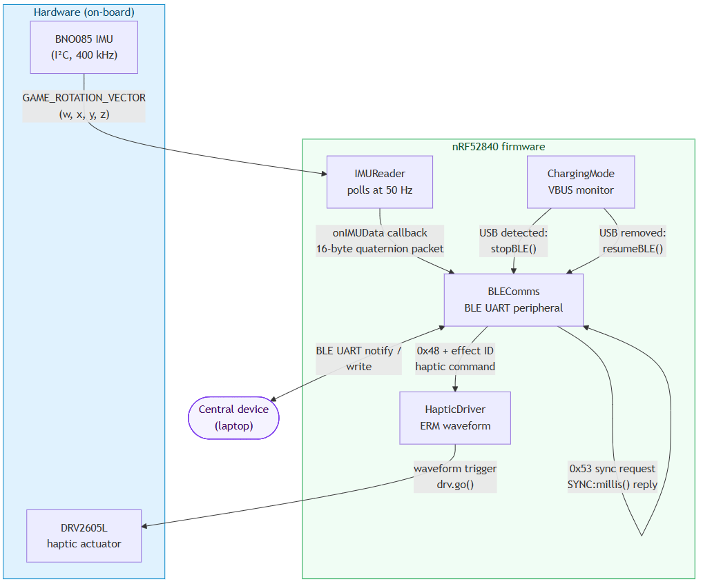

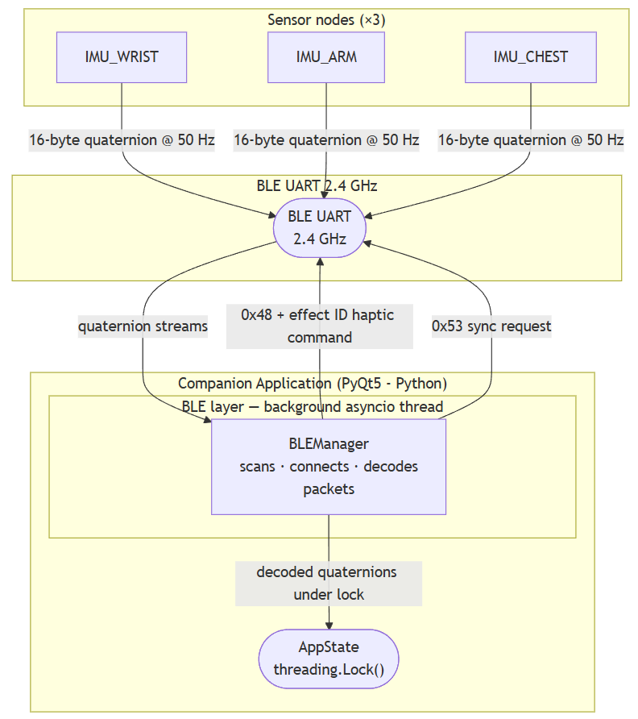

**BLE thread (`BLEManager`)** — runs an asyncio event loop on a daemon thread. Scans for `IMU_WRIST`, `IMU_ARM`, and `IMU_CHEST` in parallel, auto-reconnects on dropout, decodes 20-byte quaternion packets, and writes them into `AppState` under a `threading.Lock`. Sends haptic (`0x48` + effect ID) and sync (`0x53`) commands back to the nodes.

**GUI thread (`MainWindow`)** — a 50 Hz `QTimer` calls `_tick()` every 20 ms. Each tick: updates joint angles via `AngleProcessor`, evaluates rep/hold detection, fires haptic commands where needed, records a CSV frame, and refreshes the visible panel.

---

## Application Structure

```
Graph_3D_v7/
├── main.py                     # Entry point — wires all components, starts BLE
├── requirements.txt
├── ble/
│   ├── ble_manager.py          # BLE scan / connect / receive / send (asyncio)
│   └── ble_state.py            # AppState, IMUSlot — shared thread-safe state
├── calc/
│   ├── joint_angles.py         # Quaternion → clinical angles (AngleProcessor)
│   ├── calibration.py          # 3-second I-pose averaged calibration
│   ├── rep_detector.py         # Rep counting and hold timer state machine
│   ├── stage_detector.py       # Frozen shoulder stage classifier (SQLite)
│   ├── session_recorder.py     # CSV frame writer + SQLite session index
│   └── exercise_library.py     # ExerciseDef dataclass + full exercise list
├── gui/
│   ├── main_window.py          # QMainWindow shell, 50 Hz timer, haptic logic
│   ├── styles.py               # Global QSS stylesheet and colour constants
│   ├── panels/
│   │   ├── connect_panel.py    # Device setup wizard, sensor cards, calibration
│   │   ├── exercise_panel.py   # Exercise picker, set/rep config, START SESSION
│   │   ├── session_panel.py    # Live 3D view, HUD, smoothness, haptic log
│   │   ├── analytics_panel.py  # ROM trends, session history, stage classifier
│   │   └── settings_panel.py   # Affected side, haptic toggles, ROM limits
│   └── widgets/
│       ├── render_widget.py    # PyQtGraph OpenGL arm skeleton + anatomical planes
│       ├── rom_wizard.py       # Guided ROM measurement wizard
│       └── exercise_guide.py   # Therapist phantom guide playback
└── data/
    ├── sessions.db             # SQLite session index
    └── session_*.csv           # Per-session angle frame files
```

---

## Panels

### Connect

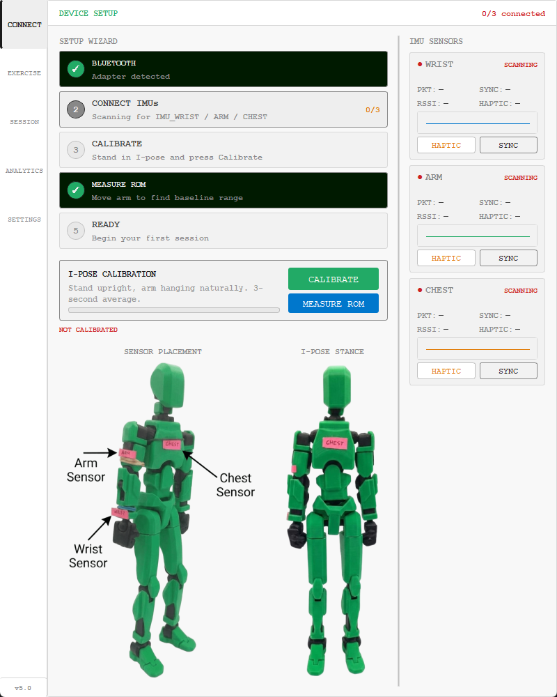

The setup wizard walks through five steps in order: Bluetooth adapter detected → IMUs connected (3/3) → I-pose calibration → ROM measured → Ready. The right column shows a live sensor card per IMU with packet count, sync offset, a sparkline of quaternion noise, and buttons to fire a haptic or sync request to that node individually.

**Sensor placement** is shown at the bottom of the panel with a labelled diagram.

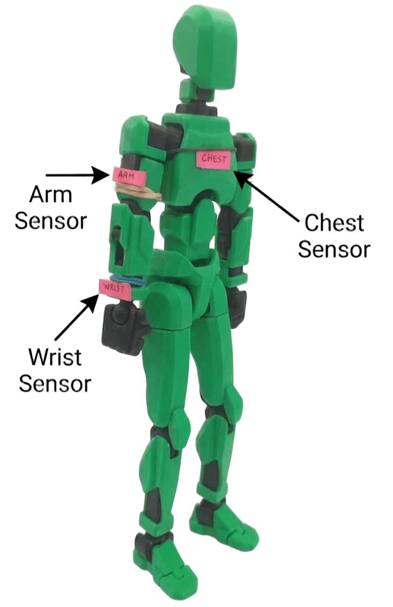

**Calibration** captures a 3-second average of all three sensors while the patient stands in I-pose (arm hanging naturally at the side). The quaternion eigenvalue method is used to compute the mean across samples, which is robust to orientation ambiguity (quaternion double-cover). All subsequent joint angles are computed relative to this reference.

---

### Exercise

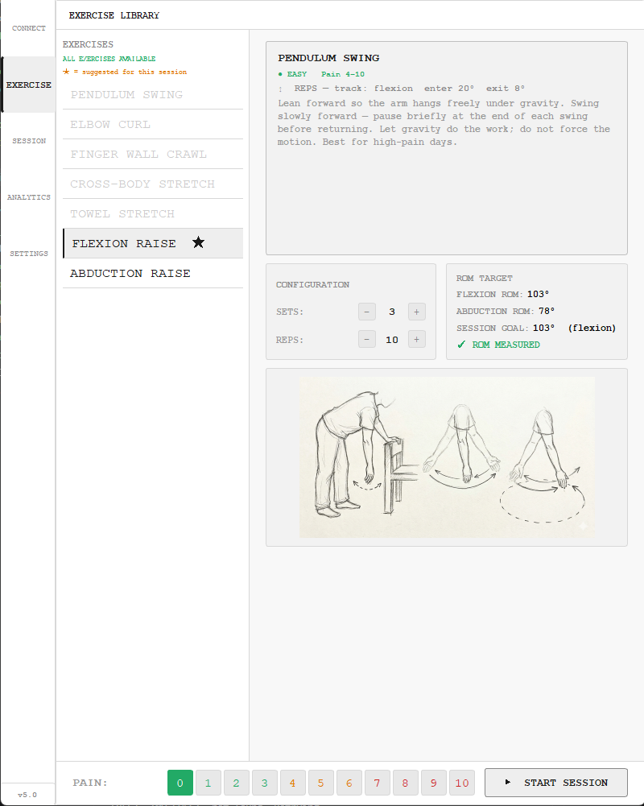

The left sidebar lists the full exercise library. Exercises are filtered by the patient's current pain level (0–10 scale at the bottom). A star marks the suggested exercise for this session, chosen by prioritising exercises not recently attempted.

Selecting an exercise shows its description, illustration, and a configuration panel for sets and reps (or hold duration for stretch exercises). The **ROM Target** card displays the current measured ROM limits and the session goal (90% of ROM limit by default).

Pressing **Start Session** emits a signal to `MainWindow`, which starts the `SessionRecorder`, configures the `RepDetector` for the chosen `ExerciseDef`, and navigates to the Session panel.

---

### Session

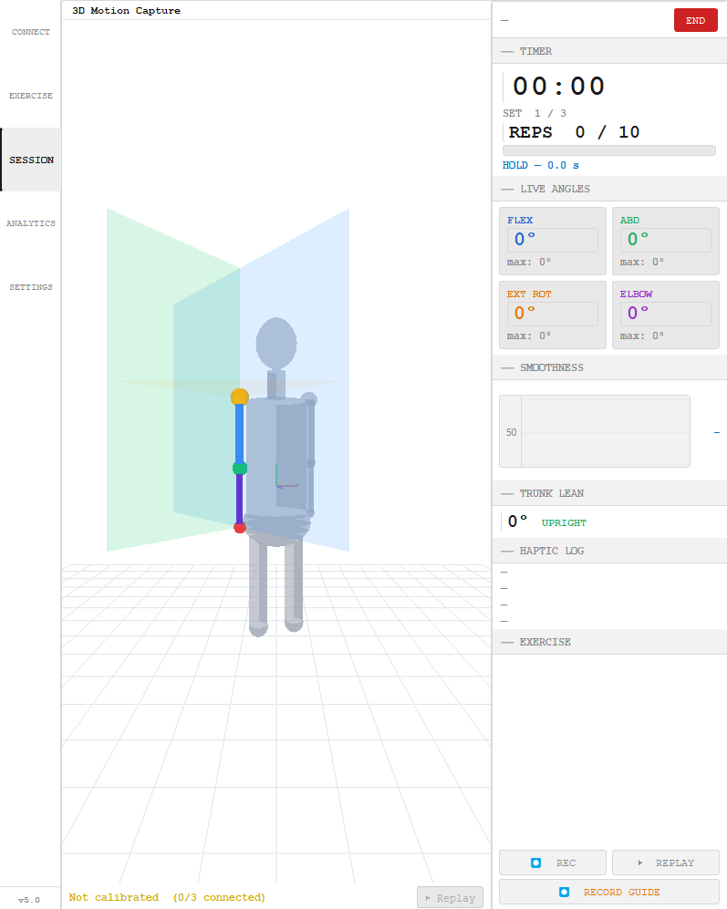

The session panel is the main working view during exercise.

**Left — 3D Renderer (`RenderWidget`):** A PyQtGraph OpenGL scene shows a phantom body with the live arm rendered as a coloured bone skeleton (amber shoulder joint → blue upper arm → teal elbow joint → violet forearm → red wrist). Two semi-transparent anatomical plane meshes (blue = sagittal, green = frontal) illuminate dynamically based on which plane the arm is moving in, giving the patient immediate visual feedback on movement quality.

**Right — HUD:** Shows the session timer, current set / rep count (or hold progress bar), four live joint angle readouts (flexion, abduction, external rotation, elbow) each with their session maximum, a smoothness line graph, trunk lean indicator, and a timestamped haptic event log.

**Rep detection** uses a dwell-then-exit state machine per `ExerciseDef`: the tracked angle must exceed `rep_enter_deg` and hold for `rep_hold_s` seconds before the arm is registered as raised, then must fall below `rep_exit_deg` for the rep to count. A 1.2-second haptic lockout suppresses false detections caused by physical vibration from the motor.

**Haptic feedback** is fired automatically for: rep complete, set complete (rest interval), hold complete, ROM boundary reached (90% of limit), movement plane deviation, and trunk lean. Each event type uses a distinct DRV2605L waveform effect.

---

## Joint Angle Computation

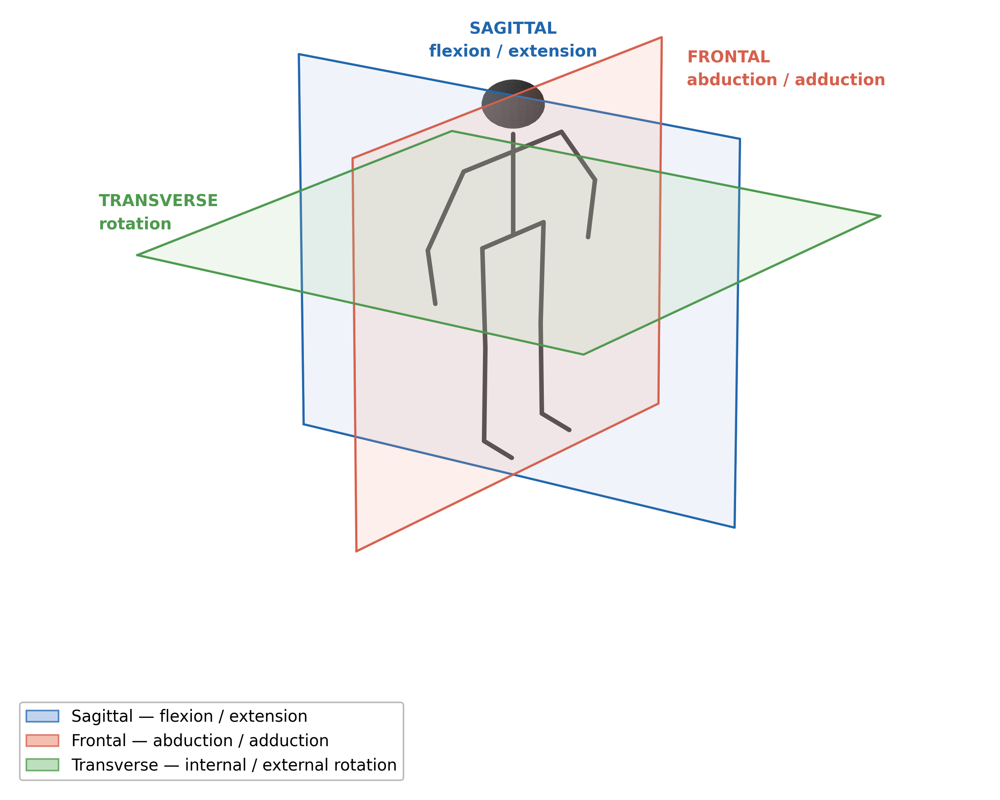

Four clinical angles are computed at 50 Hz from the three IMU quaternion streams.

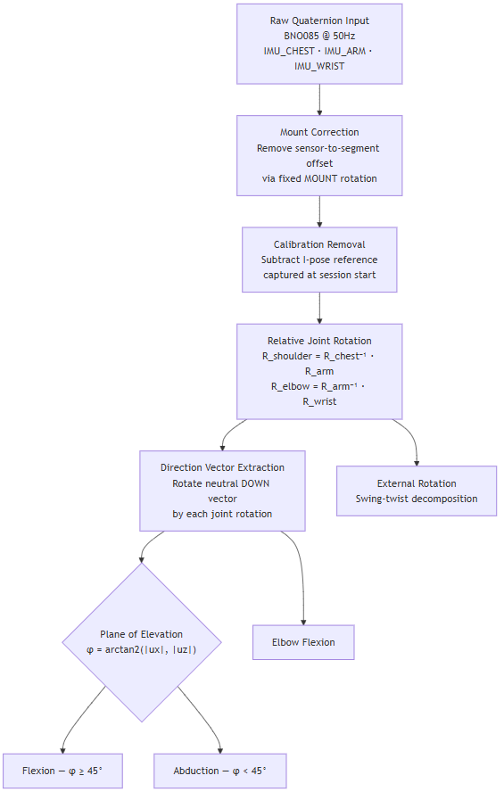

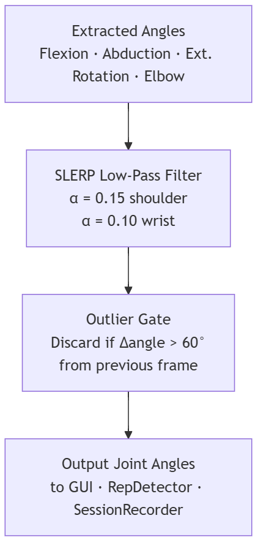

The pipeline runs in `AngleProcessor.update()` every tick:

**1. Mount correction** — each raw sensor quaternion is multiplied by a fixed `MOUNT` rotation that maps the physical sensor axes onto the shared anatomical frame (X=FORWARD, Y=UP, Z=RIGHT). Separate mount matrices are defined for right and left arm.

**2. Calibration removal** — the I-pose reference quaternion (captured at calibration) is subtracted from the live reading, so all angles are measured from the neutral hanging position.

**3. Relative joint rotations** — `R_shoulder = R_chest⁻¹ · R_arm` gives the rotation of the upper arm relative to the torso. `R_elbow = R_arm⁻¹ · R_wrist` gives forearm relative to upper arm.

**4. Direction vectors** — the neutral DOWN vector `(0, −1, 0)` is rotated by each joint rotation to get the unit direction of each limb segment in the anatomical frame.

**5. Angle extraction:**
- **Shoulder flexion** — `atan2(forward_component, down_component)` of the upper arm direction. Positive = forward elevation.
- **Shoulder abduction** — `atan2(lateral_component, down_component)`. Positive = sideways elevation. Both flexion and abduction are non-zero simultaneously for diagonal movements.
- **External rotation** — swing-twist decomposition of `R_shoulder` about the humerus long axis.
- **Elbow flexion** — `arccos(dot(upper_arm_unit, forearm_unit))`, always 0°–180°.

**6. SLERP low-pass filter** — quaternions are filtered before angle extraction using spherical linear interpolation (α = 0.15 for shoulder sensors, 0.10 for wrist). This eliminates high-frequency sensor noise without introducing linear-domain gimbal artifacts.

**7. Outlier gate** — any single-frame jump larger than 45° is held at the previous value. This catches BLE packet loss artifacts and physical cable pull events.

---

### Analytics

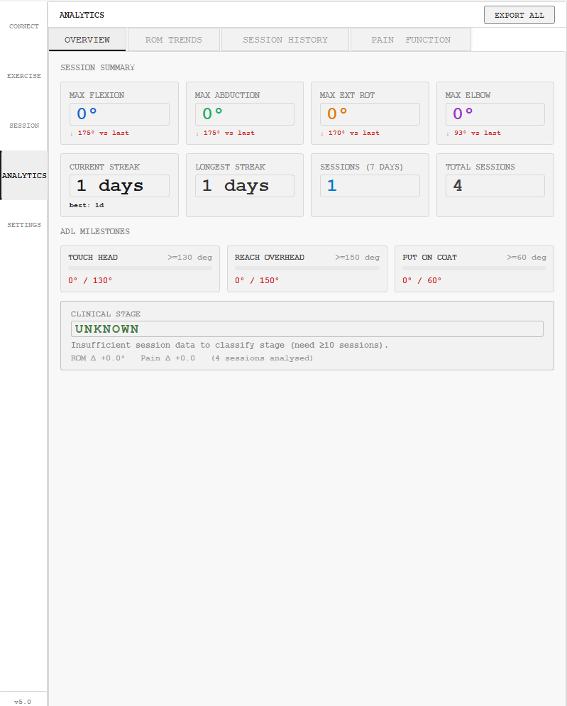

Four tabs: **Overview** shows session maxima for each angle with a delta vs the previous session, adherence streak counters, ADL milestone progress (touch head ≥130°, reach overhead ≥150°, put on coat ≥60°), and a clinical stage classifier. **ROM Trends** plots each angle over time. **Session History** is a scrollable table of all recorded sessions. **Pain & Function** plots pre/post pain scores over time.

**Stage classifier (`stage_detector.py`)** queries the last 10 SQLite sessions, computes rolling averages of max flexion and pain score over two consecutive 5-session windows, and classifies the clinical stage as THAWING (ROM improving + pain falling), FREEZING (ROM declining or pain increasing), or FROZEN (plateau).

---

## Data Storage

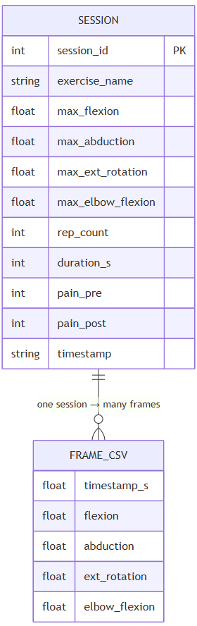

Each session writes two files:

**`data/session_YYYYMMDD_HHMMSS.csv`** — frame-level log at 50 Hz, columns: `timestamp_s`, `flexion`, `abduction`, `ext_rot`, `elbow`. Written continuously during the session, flushed on close. Discarded (deleted) if the patient cancels without completing.

**`data/sessions.db`** — SQLite index. One row per completed session with exercise name, duration, rep count, angle maxima, and pre/post pain scores. Used by the Analytics panel and the stage classifier. ROM limits are also persisted here so they survive application restarts.

---

## Settings

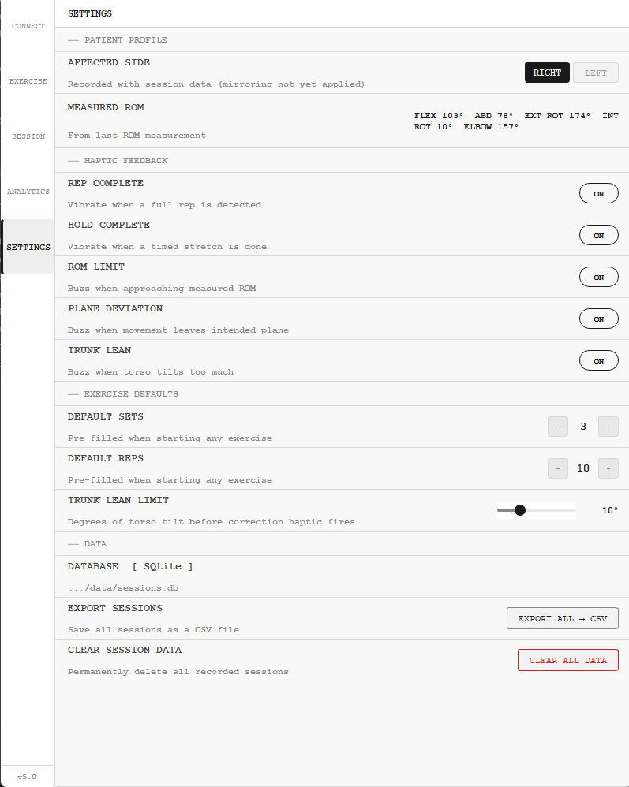

User-configurable options written directly into `AppState`: affected side (right/left, which flips the mount matrices), per-event haptic toggles (rep, ROM boundary, plane deviation, trunk lean, hold complete), ROM goal fraction (default 90%), trunk lean limit (default 10°), and default sets/reps for new sessions.